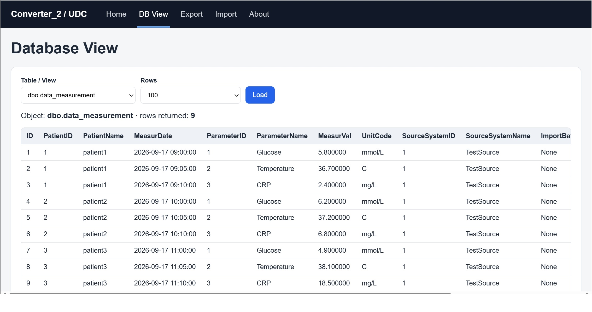
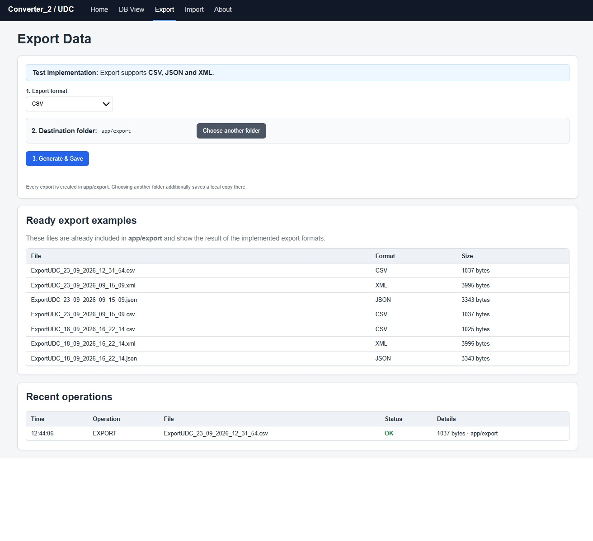

# Universal Data Converter

Universal Data Converter is a backend-oriented data integration project designed to transform heterogeneous source data into a standardized internal structure and prepare it for export to external systems, research partners, or other databases.

The project is currently being developed as a practical portfolio project using Python and Microsoft SQL Server.

## Project Goal

The main goal is to build a flexible converter that can:

* read data from different sources;
* transform source-specific structures into a standardized format;
* validate incoming and outgoing data;
* anonymize sensitive subject information;
* export data into different formats or external systems;
* support reverse import and data synchronization;
* keep the architecture extendable for future adapters and automation.

## Current Architecture

```text
Source Data
    |
    v
Microsoft SQL Server
    |
    v
dbo.data_measurement
    |
    v
dbo.vw_data_measure_map
    |
    v
Standardized Data Structure
    |
    v
Python Backend
    |
    +--> CSV
    +--> JSON
    +--> XML
    +--> SQL
    +--> API
```
## Application preview

The screenshots below show the web interface. They remain available even when the live demo is offline.

### Home


### Database viewer



### Export



### Import


