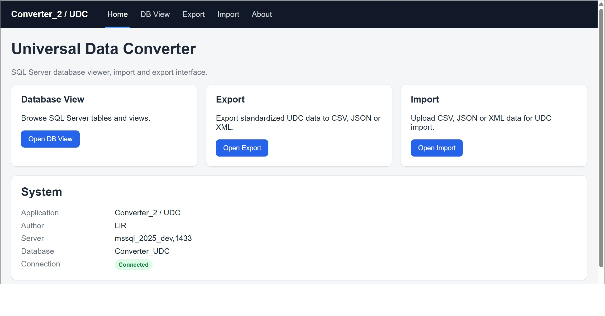
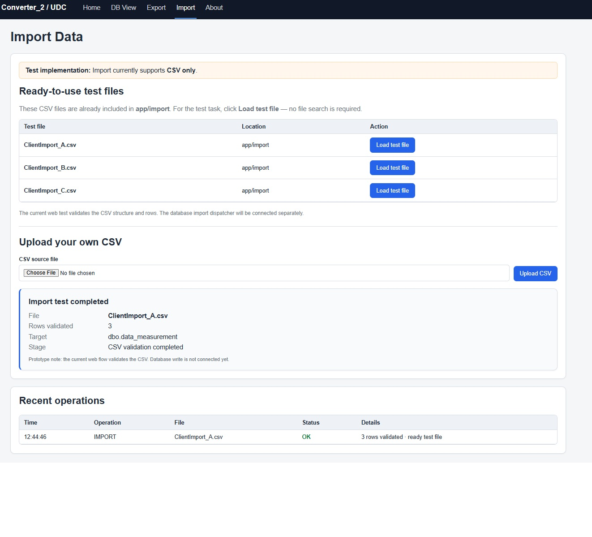

# UDC — Universal Data Converter

A demonstration project for organizing data conversion workflows with Python and Microsoft SQL Server.

The project shows how database records can be presented in a standardized structure, inspected through a web interface, and exported to CSV, JSON, or XML.

All included data is synthetic and intended only for testing and demonstration.
## Application preview

The screenshots below show the web interface. They remain available even when the live demo is offline.

### Home



### Database viewer


### Export


### Import



## Repository overview

```text
UDC-UniversalDataConverter/
├── 1_udc/              # Backend-oriented converter prototype
├── 2_UDC_web/          # Flask web application and Docker environment
├── 3_UDC_Codespaces/   # GitHub Codespaces setup and demo guide
├── .devcontainer/      # Codespaces development environment configuration
└── README.md
```

### 1_udc — Backend prototype

The backend-oriented implementation explores data mapping and conversion using Python and SQL Server.

### 2_UDC_web — Web prototype

A Flask application for demonstrating the workflow in a browser:

- Browse database tables and views.
- Export standardized data to CSV, JSON, or XML.
- Validate CSV import samples.
- View recent import and export operation status.

Docker Compose runs SQL Server, database initialization, and the web application with persistent database volumes.

The current CSV import workflow validates file structure and data rows. Writing imported data to the database is planned for a later stage.

### 3_UDC_Codespaces — Cloud demo guide

Step-by-step instructions for running the web prototype in GitHub Codespaces and sharing it through an HTTPS link.

## Live demo

[Open UniversalDataConverter — Live Demo](https://ominous-sniffle-jrr7qpg9pv9cjqqj-5000.app.github.dev/)

Visitors do not need to install software, clone the repository, or run commands.

GitHub may display a **Codespaces Access Port** notice. Click **Continue** to open the demo. No GitHub sign-in is required when port 5000 is Public.

The demo is available while the Codespace and application are running.

## Project status

This is an early demonstration prototype, not a production-ready system.

Further development includes full CSV-to-database import integration, extended field mapping, stronger validation, improved error handling, and additional automated tests.

An AI coding agent assisted with selected implementation, refactoring, and documentation tasks. Architecture, backend logic, database design, integration decisions, testing, and final technical review remained my responsibility.

## Setup and instructions

Each main directory contains its own documentation:

- [Backend overview and instructions](1_udc/readme.md)
- [Web application setup and instructions](2_UDC_web/README_UDC.md)
- [Codespaces setup and demo instructions](3_UDC_Codespaces/readme.md)

## Author

LiR